# Implementation Plan: K8s Multi-User Deployment

This document outlines the coding tasks required to transform vibe-kanban from a single-user desktop application into a multi-tenant Kubernetes deployment with complete user isolation.

## Overview

**Total Estimated Duration:** 3-4 weeks
**Total Tasks:** 45
**Phases:** 3

---

## Phase 1: Foundation (Auth, DB Schema)

### Task 1: Create UserContext and Auth Error Types

- [x] 1.1 Define UserContext struct and authentication error types
  - Create `crates/server/src/middleware/auth.rs` with UserContext struct containing `user_id: Uuid` and `email: Option<String>`
  - Define `AuthError` enum with variants: `MissingAuthHeader`, `InvalidToken`, `ExpiredToken`, `MissingClaim(String)`
  - Implement `IntoResponse` for `AuthError` to return appropriate HTTP status codes (401, 400)
  - Add `Clone`, `Debug`, `Serialize`, `Deserialize` derives for UserContext
  - Write unit tests for error response formatting
  - _Requirements: 1.1, 1.2, 1.6_
  - **Files:** `crates/server/src/middleware/auth.rs` (new), `crates/server/src/middleware/mod.rs`
  - **Dependencies:** None
  - **Complexity:** S

- [x] 1.2 Implement JWT validation logic
  - Add `jsonwebtoken` crate to `crates/server/Cargo.toml`
  - Create `verify_jwt` function that validates token signature using `JWT_SECRET` environment variable
  - Extract `sub` (user_id as UUID) and optional `email` claims from token payload
  - Validate token expiration (`exp` claim)
  - Write unit tests for valid/invalid/expired token scenarios
  - _Requirements: 1.2, 1.5, 12.5_
  - **Files:** `crates/server/src/middleware/auth.rs`, `crates/server/Cargo.toml`
  - **Dependencies:** 1.1
  - **Complexity:** M

- [x] 1.3 Implement require_auth middleware function
  - Create `require_auth` async function compatible with Axum middleware
  - Extract Bearer token from Authorization header
  - Call `verify_jwt` and create UserContext on success
  - Insert UserContext into request extensions
  - Return appropriate error responses for missing/invalid tokens
  - Write integration tests for middleware with test JWT tokens
  - _Requirements: 1.1, 1.2, 1.3, 1.4_
  - **Files:** `crates/server/src/middleware/auth.rs`
  - **Dependencies:** 1.2
  - **Complexity:** M

- [x] 1.4 Create helper to extract UserContext from request extensions
  - Implement `extract_user_context` function for route handlers
  - Create Axum extractor `UserContextExt` that wraps UserContext
  - Handle missing UserContext with appropriate error
  - Write unit tests for extraction
  - _Requirements: 1.4_
  - **Files:** `crates/server/src/middleware/auth.rs`
  - **Dependencies:** 1.3
  - **Complexity:** S

---

### Task 2: PostgreSQL Database Migration

- [x] 2.1 Update DBService for PostgreSQL support
  - Modify `crates/db/src/lib.rs` to use `Pool<Postgres>` instead of `Pool<Sqlite>`
  - Add PostgreSQL feature to SQLx dependency in `crates/db/Cargo.toml`
  - Update `DATABASE_URL` parsing to support PostgreSQL connection strings
  - Implement connection pooling with configurable `max_connections` (default: 10)
  - Write unit tests for connection pool initialization
  - _Requirements: 2.1, 2.2_
  - **Files:** `crates/db/src/lib.rs`, `crates/db/Cargo.toml`
  - **Dependencies:** None
  - **Complexity:** M

- [x] 2.2 Create PostgreSQL migration: Add user_id columns
  - Create migration `20260122000001_add_user_id_columns.sql`
  - Add nullable `user_id UUID` column to: `projects`, `tasks`, `workspaces`, `sessions`, `execution_processes`, `repos`
  - Use `ALTER TABLE ... ADD COLUMN IF NOT EXISTS` for idempotency
  - Document migration rollback procedure
  - _Requirements: 2.4_
  - **Files:** `crates/db/pg_migrations/20260122000001_initial_schema.sql`, `crates/db/pg_migrations/20260122000002_user_configs.sql`, `crates/db/pg_migrations/20260122000003_pty_sessions.sql`, `crates/db/pg_migrations/20260122000004_user_indexes.sql` (new), `crates/db/src/pg.rs` (updated)
  - **Dependencies:** 2.1
  - **Complexity:** M

- [x] 2.3 Create PostgreSQL migration: Add NOT NULL constraints
  - Created migration `20260122000005_user_id_not_null.sql`
  - Added NOT NULL constraints to all user_id columns (idempotent with verification)
  - Added foreign key considerations documentation
  - _Requirements: 2.4_
  - **Files:** `crates/db/pg_migrations/20260122000005_user_id_not_null.sql` (new)
  - **Dependencies:** 2.2
  - **Complexity:** S

- [x] 2.4 Create PostgreSQL migration: Add user_id indexes
  - Created migration `20260122000004_user_indexes.sql`
  - Created indexes: `idx_projects_user_id`, `idx_tasks_user_id`, `idx_workspaces_user_id`, `idx_sessions_user_id`, `idx_execution_processes_user_id`, `idx_repos_user_id`
  - Created composite indexes: `idx_tasks_user_project`, `idx_workspaces_user_task`, `idx_sessions_user_workspace`
  - Uses `CREATE INDEX IF NOT EXISTS` for idempotency
  - _Requirements: 2.7_
  - **Files:** `crates/db/pg_migrations/20260122000004_user_indexes.sql` (existing)
  - **Dependencies:** 2.3
  - **Complexity:** S

- [x] 2.5 Create user_configs table migration
  - Already exists in migration `20260122000002_user_configs.sql`
  - Contains `user_configs` table with: `user_id UUID PRIMARY KEY`, `config_json JSONB NOT NULL DEFAULT '{}'`, `oauth_credentials BYTEA`, `created_at TIMESTAMPTZ`, `updated_at TIMESTAMPTZ`
  - Includes trigger for automatic `updated_at` timestamp update
  - _Requirements: 4.2, 4.4_
  - **Files:** `crates/db/pg_migrations/20260122000002_user_configs.sql` (existing)
  - **Dependencies:** 2.1
  - **Complexity:** S

- [x] 2.6 Create pty_sessions tracking table migration
  - Created migration `20260122000003_pty_sessions.sql`
  - Created `pty_sessions` table with: `id UUID PRIMARY KEY`, `user_id UUID NOT NULL`, `workspace_id UUID REFERENCES workspaces(id) ON DELETE SET NULL`, `created_at TIMESTAMPTZ`, `last_activity_at TIMESTAMPTZ`
  - Created indexes: `idx_pty_sessions_user_id`, `idx_pty_sessions_activity`, plus additional indexes for workspace and user-activity
  - _Requirements: 5.3_
  - **Files:** `crates/db/pg_migrations/20260122000003_pty_sessions.sql` (existing)
  - **Dependencies:** 2.3
  - **Complexity:** S

---

### Task 3: Update Database Queries with user_id Filtering

- [x] 3.1 Update projects queries with user_id filtering
  - Modify all project queries in `crates/db/src/` to include `user_id` parameter
  - Add `WHERE user_id = $n` clause to SELECT queries
  - Auto-set `user_id` on INSERT operations
  - Write tests verifying user isolation (user A cannot see user B's projects)
  - _Requirements: 2.5, 2.6, 2.8_
  - **Files:** `crates/db/src/pg/projects.rs` (new PostgreSQL-specific query module)
  - **Dependencies:** 2.3
  - **Complexity:** M

- [x] 3.2 Update tasks queries with user_id filtering
  - Modify all task queries to include `user_id` parameter
  - Ensure task listing only returns user's own tasks
  - Auto-set `user_id` on INSERT operations
  - Write tests for user isolation
  - _Requirements: 2.5, 2.6, 2.8_
  - **Files:** `crates/db/src/pg/tasks.rs` (new PostgreSQL-specific query module)
  - **Dependencies:** 2.3
  - **Complexity:** M

- [x] 3.3 Update workspaces queries with user_id filtering
  - Modify all workspace queries to include `user_id` parameter
  - Ensure workspace listing only returns user's own workspaces
  - Write tests for user isolation
  - _Requirements: 2.5, 2.6, 2.8, 3.5_
  - **Files:** `crates/db/src/pg/workspaces.rs` (new PostgreSQL-specific query module)
  - **Dependencies:** 2.3
  - **Complexity:** M

- [x] 3.4 Update sessions and execution_processes queries with user_id filtering
  - Modify session and execution process queries to include `user_id`
  - Ensure process listing only returns user's own processes
  - Write tests for user isolation
  - _Requirements: 2.5, 2.6, 2.8, 7.3_
  - **Files:** `crates/db/src/pg/sessions.rs`, `crates/db/src/pg/execution_processes.rs` (new PostgreSQL-specific query modules)
  - **Dependencies:** 2.3
  - **Complexity:** M

- [x] 3.5 Update repos queries with user_id filtering
  - Modify repo queries to include `user_id` parameter
  - Ensure repo listing only returns user's own repos
  - Write tests for user isolation
  - _Requirements: 2.5, 2.6, 2.8_
  - **Files:** `crates/db/src/pg/repos.rs` (new PostgreSQL-specific query module)
  - **Dependencies:** 2.3
  - **Complexity:** S

---

## Phase 2: Service Modifications

### Task 4: WorkspaceManager Multi-User Support

- [x] 4.1 Implement user-specific workspace base directory calculation
  - Add `get_workspace_base_dir_for_user(user_id: &Uuid) -> PathBuf` to WorkspaceManager
  - Return path in format `/workspaces/{user_id}/`
  - Support configurable base via `WORKSPACE_BASE_DIR` environment variable
  - Write unit tests for path generation
  - _Requirements: 3.1, 3.2_
  - **Files:** `crates/services/src/services/workspace_manager.rs`
  - **Dependencies:** 1.1
  - **Complexity:** S

- [x] 4.2 Implement workspace path validation
  - Create `validate_user_path(user_id: &Uuid, path: &Path) -> Result<PathBuf, WorkspaceError>`
  - Canonicalize path to resolve `..` and symlinks
  - Verify canonicalized path starts with user's base directory
  - Return `WorkspaceError::Unauthorized` for invalid paths
  - Write unit tests including path traversal attack scenarios
  - _Requirements: 3.3, 3.4, 3.7, 8.3_
  - **Files:** `crates/services/src/services/workspace_manager.rs`
  - **Dependencies:** 4.1
  - **Complexity:** M

- [x] 4.3 Update create_workspace to accept user_id parameter
  - Modify `create_workspace` signature to include `user_id: &Uuid` parameter
  - Call `validate_user_path` before workspace creation
  - Create user's base directory if it doesn't exist
  - Write integration tests for workspace creation with user isolation
  - _Requirements: 3.1, 3.6_
  - **Files:** `crates/services/src/services/workspace_manager.rs`
  - **Dependencies:** 4.2
  - **Complexity:** M

- [x] 4.4 Update WorktreeManager with user-aware paths
  - Modify `get_worktree_base_dir` to accept optional `user_id` parameter
  - Update worktree creation to use user-specific paths
  - Write tests for worktree isolation
  - _Requirements: 3.2, 6.2_
  - **Files:** `crates/services/src/services/worktree_manager.rs`
  - **Dependencies:** 4.1
  - **Complexity:** S

---

### Task 5: ConfigService Database Migration

- [x] 5.1 Create ConfigService struct with PostgreSQL backend
  - Create `crates/services/src/services/config_db.rs` (new file)
  - Define `ConfigServicePg` struct with `Pool<Postgres>` and `encryption_key: [u8; 32]`
  - Implement constructor that reads `CONFIG_ENCRYPTION_KEY` from environment
  - Write basic initialization tests
  - _Requirements: 4.1_
  - **Files:** `crates/services/src/services/config_db.rs` (new), `crates/services/src/services/mod.rs`
  - **Dependencies:** 2.1, 2.5
  - **Complexity:** M

- [x] 5.2 Implement load_config for database-backed configuration
  - Implement `load_config(&self, user_id: Uuid) -> Result<Config, ConfigDbError>`
  - Query `user_configs` table by `user_id`
  - Return sensible default `Config` if no record exists
  - Parse JSONB `config_json` into `Config` struct
  - Write tests for existing and non-existing configurations
  - _Requirements: 4.1, 4.3_
  - **Files:** `crates/services/src/services/config_db.rs`
  - **Dependencies:** 5.1
  - **Complexity:** M

- [x] 5.3 Implement save_config for database-backed configuration
  - Implement `save_config(&self, user_id: Uuid, config: &Config) -> Result<(), ConfigDbError>`
  - Use UPSERT (INSERT ... ON CONFLICT DO UPDATE) pattern
  - Serialize `Config` to JSONB
  - Automatically update `updated_at` timestamp
  - Write tests for insert and update scenarios
  - _Requirements: 4.2, 4.4_
  - **Files:** `crates/services/src/services/config_db.rs`
  - **Dependencies:** 5.2
  - **Complexity:** M

- [x] 5.4 Implement OAuth credential encryption/decryption
  - Add `aes-gcm` crate to dependencies
  - Implement `encrypt_credentials(creds: &Credentials) -> Vec<u8>`
  - Implement `decrypt_credentials(encrypted: &[u8]) -> Result<Credentials, ConfigDbError>`
  - Use AES-256-GCM with random nonce
  - Write tests for encryption round-trip
  - _Requirements: 4.5, 4.6, 12.2_
  - **Files:** `crates/services/src/services/config_db.rs`, `crates/services/Cargo.toml`
  - **Dependencies:** 5.1
  - **Complexity:** M

- [x] 5.5 Implement get_credentials and save_credentials methods
  - Implement `get_credentials(&self, user_id: Uuid) -> Result<Option<Credentials>, ConfigDbError>`
  - Implement `save_credentials(&self, user_id: Uuid, creds: &Credentials) -> Result<(), ConfigDbError>`
  - Decrypt credentials on retrieval, encrypt on storage
  - Write tests with mock encryption key
  - _Requirements: 4.5, 4.6_
  - **Files:** `crates/services/src/services/config_db.rs`
  - **Dependencies:** 5.4
  - **Complexity:** M

---

### Task 6: PtyService Multi-User Support

- [x] 6.1 Add user_id tracking to PtySession struct
  - Modify `PtySession` struct in `crates/local-deployment/src/pty.rs` to include `user_id: Uuid`
  - Add `created_at: DateTime<Utc>` and `last_activity_at: DateTime<Utc>` fields
  - Update session storage HashMap to track ownership
  - Write unit tests for session struct
  - _Requirements: 5.3_
  - **Files:** `crates/local-deployment/src/pty.rs`
  - **Dependencies:** 1.1
  - **Complexity:** S

- [x] 6.2 Update create_session to accept user_id and validate working directory
  - Modify `create_session` signature to include `user_id: Uuid` parameter
  - Validate `working_dir` is within user's workspace using `validate_user_path`
  - Set `HOME` environment variable to user's workspace directory
  - Store session with user ownership
  - Write tests for session creation with user isolation
  - _Requirements: 5.1, 5.2, 5.3_
  - **Files:** `crates/local-deployment/src/pty.rs`
  - **Dependencies:** 6.1, 4.2
  - **Complexity:** M

- [x] 6.3 Implement session ownership validation
  - Create `validate_session_ownership(&self, session_id: &Uuid, user_id: &Uuid) -> Result<(), PtyError>`
  - Return `PtyError::NotFound` if session doesn't exist or belongs to another user
  - Call validation before any session operation (write, resize, close)
  - Write tests for ownership validation including cross-user access attempts
  - _Requirements: 5.6_
  - **Files:** `crates/local-deployment/src/pty.rs`
  - **Dependencies:** 6.2
  - **Complexity:** S

- [x] 6.4 Implement list_user_sessions method
  - Create `list_user_sessions(&self, user_id: &Uuid) -> Vec<Uuid>`
  - Return only session IDs owned by the specified user
  - Write tests for session listing
  - _Requirements: 5.4_
  - **Files:** `crates/local-deployment/src/pty.rs`
  - **Dependencies:** 6.1
  - **Complexity:** S

- [x] 6.5 Implement session timeout and cleanup
  - Add configurable `SESSION_TIMEOUT` (default: 30 minutes)
  - Create `cleanup_idle_sessions(&self, timeout: Duration)` method
  - Update `last_activity_at` on each session interaction
  - Write tests for timeout cleanup
  - _Requirements: 5.5, 5.7_
  - **Files:** `crates/local-deployment/src/pty.rs`
  - **Dependencies:** 6.1
  - **Complexity:** M

---

### Task 7: GitService Multi-User Support

- [x] 7.1 Add path validation to Git operations
  - Create wrapper function `validate_git_path(user_id: &Uuid, repo_path: &Path) -> Result<PathBuf, GitServiceError>`
  - Call validation before `open_repo`, `commit`, `add_worktree`, and other operations
  - Return `GitServiceError::Unauthorized` for invalid paths
  - Write tests for path validation in Git context
  - _Requirements: 6.1, 6.3_
  - **Files:** `crates/services/src/services/git.rs`
  - **Dependencies:** 4.2
  - **Complexity:** M

- [x] 7.2 Update add_worktree to validate user boundaries
  - Validate both `repo_path` and `worktree_path` are within user's workspace
  - Ensure created worktrees go to user's workspace base directory
  - Write tests for worktree creation with user isolation
  - _Requirements: 6.2_
  - **Files:** `crates/services/src/services/git.rs`
  - **Dependencies:** 7.1
  - **Complexity:** S

- [x] 7.3 Implement Git credential retrieval from ConfigService
  - Update Git operations to retrieve OAuth credentials from ConfigService by user_id
  - Configure Git credential helper with user's credentials
  - Write tests with mock credentials
  - _Requirements: 6.4_
  - **Files:** `crates/services/src/services/git.rs`
  - **Dependencies:** 5.5
  - **Complexity:** M

---

### Task 8: ContainerService/Process Multi-User Support

- [x] 8.1 Add user_id tracking to process management
  - Update `child_store`, `interrupt_senders`, `msg_stores` HashMaps to include user_id association
  - Create helper method to look up processes by (user_id, process_id)
  - Write tests for process tracking
  - _Requirements: 7.2_
  - **Files:** `crates/local-deployment/src/container.rs`
  - **Dependencies:** 1.1
  - **Complexity:** M

- [x] 8.2 Update process spawning to validate working directory
  - Validate `workspace.container_ref` path is within user's workspace
  - Set working directory to validated path
  - Store process with user ownership
  - Write tests for process spawning with user isolation
  - _Requirements: 7.1, 7.2_
  - **Files:** `crates/local-deployment/src/container.rs`
  - **Dependencies:** 8.1, 4.2
  - **Complexity:** M

- [x] 8.3 Implement process ownership validation for operations
  - Validate user ownership before `terminate`, `get_status`, and other operations
  - Return `404 Not Found` for unauthorized access attempts
  - Write tests for ownership validation
  - _Requirements: 7.4_
  - **Files:** `crates/local-deployment/src/container.rs`
  - **Dependencies:** 8.1
  - **Complexity:** S

- [x] 8.4 Implement list_user_processes method
  - Create method to list only processes owned by authenticated user
  - Return process IDs and status information
  - Write tests for process listing
  - _Requirements: 7.3_
  - **Files:** `crates/local-deployment/src/container.rs`
  - **Dependencies:** 8.1
  - **Complexity:** S

- [x] 8.5 Isolate message stores by user_id
  - Update `msg_stores` to namespace by user_id
  - Ensure message retrieval validates user ownership
  - Clean up message stores when process terminates
  - Write tests for message isolation
  - _Requirements: 7.5, 7.6_
  - **Files:** `crates/local-deployment/src/container.rs`
  - **Dependencies:** 8.1
  - **Complexity:** M

---

### Task 9: FilesystemService Multi-User Support

- [x] 9.1 Update default path to return user's workspace
  - Modify `get_home_directory` or equivalent to accept `user_id` parameter
  - Return user's workspace base directory instead of system home
  - Write tests for default path resolution
  - _Requirements: 8.2_
  - **Files:** `crates/services/src/services/filesystem.rs`
  - **Dependencies:** 4.1
  - **Complexity:** S

- [x] 9.2 Implement path restriction for directory listing
  - Validate all paths in `list_git_repos` and similar methods against user's workspace
  - Resolve and validate paths before any filesystem operation
  - Return error for paths outside user boundary
  - Write tests including path traversal attempts
  - _Requirements: 8.1, 8.3, 8.5_
  - **Files:** `crates/services/src/services/filesystem.rs`
  - **Dependencies:** 9.1, 4.2
  - **Complexity:** M

- [x] 9.3 Update Git repository search to user's workspace only
  - Modify `list_git_repos` to only search within user's workspace directory
  - Apply user workspace constraint before other filters
  - Write tests for repository search isolation
  - _Requirements: 8.4_
  - **Files:** `crates/services/src/services/filesystem.rs`
  - **Dependencies:** 9.2
  - **Complexity:** S

---

### Task 10: LocalDeployment Mode Detection

- [x] 10.1 Add DeploymentMode enum and detection
  - Create `DeploymentMode` enum with `Desktop` and `Kubernetes` variants
  - Add `mode: DeploymentMode` field to `LocalDeployment` struct
  - Detect mode from `DEPLOYMENT_MODE` environment variable (default: `desktop`)
  - Add `is_k8s_mode()` helper method
  - Write tests for mode detection
  - _Requirements: Design Component 6_
  - **Files:** `crates/local-deployment/src/lib.rs`
  - **Dependencies:** None
  - **Complexity:** S

- [x] 10.2 Conditionally initialize services based on deployment mode
  - Initialize PostgreSQL DBService in K8s mode, SQLite in desktop mode
  - Initialize ConfigService (database-backed) in K8s mode, file-based in desktop mode
  - Apply auth middleware only in K8s mode
  - Write tests for conditional initialization
  - _Requirements: Design Component 6_
  - **Files:** `crates/local-deployment/src/lib.rs`
  - **Dependencies:** 10.1, 2.1, 5.1
  - **Complexity:** M

---

### Task 11: Route Handler Updates

- [x] 11.1 Update projects routes to extract and use UserContext
  - Added `OptionalUserContext` extractor to `get_projects`, `create_project`, `delete_project` handlers
  - User context is logged for tracing in multi-user mode
  - TODO comments added for K8s-mode user_id filtering (dependent on DB schema update)
  - _Requirements: 1.4, 2.5, 2.8_
  - **Files:** `crates/server/src/routes/projects.rs`
  - **Dependencies:** 1.4, 3.1
  - **Complexity:** M

- [x] 11.2 Update tasks routes to extract and use UserContext
  - Added `OptionalUserContext` extractor to `get_tasks`, `create_task`, `create_task_and_start`, `delete_task` handlers
  - User context is logged for tracing in multi-user mode
  - TODO comments added for K8s-mode user_id filtering
  - _Requirements: 1.4, 2.5, 2.8_
  - **Files:** `crates/server/src/routes/tasks.rs`
  - **Dependencies:** 1.4, 3.2
  - **Complexity:** M

- [x] 11.3 Update workspace/session routes to extract and use UserContext
  - Added `OptionalUserContext` extractor to `get_sessions`, `create_session`, `follow_up` handlers
  - User context is logged for tracing in multi-user mode
  - TODO comments added for K8s-mode workspace ownership validation
  - _Requirements: 1.4, 3.5_
  - **Files:** `crates/server/src/routes/sessions/mod.rs`
  - **Dependencies:** 1.4, 3.3, 4.3
  - **Complexity:** M

- [x] 11.4 Update terminal routes for WebSocket authentication
  - Added `token` query parameter to `TerminalQuery` for JWT authentication
  - Implemented `validate_ws_auth` function to validate JWT in K8s mode
  - WebSocket connections require valid JWT token in Kubernetes deployment mode
  - Desktop mode continues to work without authentication
  - _Requirements: 10.1, 10.5_
  - **Files:** `crates/server/src/routes/terminal.rs`
  - **Dependencies:** 1.4, 6.3
  - **Complexity:** M

- [x] 11.5 Update filesystem routes to extract and use UserContext
  - Added `OptionalUserContext` extractor to `list_directory`, `list_git_repos` handlers
  - User context is logged for tracing in multi-user mode
  - Added security event logging for unauthorized filesystem access attempts
  - TODO comments added for K8s-mode path validation
  - _Requirements: 1.4, 8.1_
  - **Files:** `crates/server/src/routes/filesystem.rs`
  - **Dependencies:** 1.4, 9.2
  - **Complexity:** S

- [x] 11.6 Update config routes to use database-backed ConfigService
  - Added `OptionalUserContext` extractor to `get_user_system_info`, `update_config` handlers
  - User context is logged for tracing in multi-user mode
  - TODO comments added for K8s-mode database-backed ConfigServicePg integration
  - _Requirements: 1.4, 4.1, 4.2_
  - **Files:** `crates/server/src/routes/config.rs`
  - **Dependencies:** 1.4, 5.2, 5.3
  - **Complexity:** M

- [x] 11.7 Apply auth middleware to protected routes
  - Updated `crates/server/src/routes/mod.rs` to conditionally apply `require_user` middleware
  - Authentication middleware is only applied when `DeploymentMode::is_kubernetes()` is true
  - Health endpoint (`/health`) remains unprotected and accessible without authentication
  - Desktop mode continues to work without authentication middleware
  - _Requirements: 1.4_
  - **Files:** `crates/server/src/routes/mod.rs`
  - **Dependencies:** 1.3, 11.1-11.6
  - **Complexity:** M

---

## Phase 3: Integration & Deployment

### Task 12: Kubernetes Manifests

- [x] 12.1 Create multi-user Deployment manifest
  - Created `k8s/multiuser/deployment.yaml`
  - Configured replicas: 2, image from ECR with placeholder
  - Added environment variables: `DEPLOYMENT_MODE=kubernetes`, `DATABASE_URL`, `JWT_SECRET`, `CONFIG_ENCRYPTION_KEY`, `WORKSPACE_BASE_DIR`
  - Mounted workspaces PVC at `/workspaces`
  - Configured resource requests/limits (memory: 512Mi-2Gi, cpu: 250m-1000m)
  - Added pod anti-affinity for spreading replicas across nodes
  - Added security context with non-root user
  - _Requirements: 9.1, 9.4, 9.7_
  - **Files:** `k8s/multiuser/deployment.yaml` (new)
  - **Dependencies:** 10.2
  - **Complexity:** M

- [x] 12.2 Create PersistentVolumeClaim for workspaces
  - Created `k8s/multiuser/pvc.yaml`
  - Configured `ReadWriteMany` access mode for multi-pod access
  - Used `efs-sc` storage class for AWS EFS
  - Requested 500Gi storage
  - _Requirements: 9.2, 9.3_
  - **Files:** `k8s/multiuser/pvc.yaml` (new)
  - **Dependencies:** None
  - **Complexity:** S

- [x] 12.3 Create EFS StorageClass manifest
  - Created `k8s/multiuser/storageclass.yaml`
  - Configured EFS CSI driver with `efs-ap` provisioning mode
  - Set directory permissions (700) and GID range (1000-2000)
  - Documented EFS file system ID placeholder (`${EFS_FILE_SYSTEM_ID}`)
  - Added volume expansion support and Retain reclaim policy
  - _Requirements: 9.3_
  - **Files:** `k8s/multiuser/storageclass.yaml` (new)
  - **Dependencies:** None
  - **Complexity:** S

- [x] 12.4 Create Service manifest
  - Created `k8s/multiuser/service.yaml`
  - Configured ClusterIP service targeting port 8081
  - Added appropriate selectors and labels
  - _Requirements: 9.1_
  - **Files:** `k8s/multiuser/service.yaml` (new)
  - **Dependencies:** 12.1
  - **Complexity:** S

- [x] 12.5 Create Ingress manifest with ALB and TLS
  - Created `k8s/multiuser/ingress.yaml`
  - Configured AWS ALB ingress controller annotations
  - Set up TLS termination with ACM certificate ARN placeholder (`${ACM_CERT_ARN}`)
  - Configured WebSocket support with increased idle timeout (3600s)
  - Added healthcheck path configuration and sticky sessions for WebSocket
  - _Requirements: 9.5, 10.4_
  - **Files:** `k8s/multiuser/ingress.yaml` (new)
  - **Dependencies:** 12.4
  - **Complexity:** M

- [x] 12.6 Create Secrets manifest template
  - Created `k8s/multiuser/secrets.yaml` with placeholder values
  - Included `database-url`, `jwt-secret`, `config-encryption-key`
  - Documented secret value requirements and generation commands
  - Added .gitignore entry for actual secrets (`k8s/multiuser/secrets.*.yaml`, `k8s/multiuser/secrets-prod.yaml`)
  - _Requirements: 9.4_
  - **Files:** `k8s/multiuser/secrets.yaml` (new), `.gitignore`
  - **Dependencies:** None
  - **Complexity:** S

- [x] 12.7 Add health endpoint with readiness and liveness probes
  - Verified `/health` endpoint already exists in `crates/server/src/routes/health.rs`
  - Configured readiness probe: HTTP GET /health, initialDelaySeconds: 10, periodSeconds: 5, failureThreshold: 3
  - Configured liveness probe: HTTP GET /health, initialDelaySeconds: 30, periodSeconds: 10, failureThreshold: 3
  - Added timeout configuration for both probes
  - _Requirements: 9.6_
  - **Files:** `crates/server/src/routes/health.rs` (existing), `k8s/multiuser/deployment.yaml`
  - **Dependencies:** 12.1
  - **Complexity:** S

---

### Task 13: Docker Image Updates

- [x] 13.1 Create multi-user Dockerfile
  - Created `Dockerfile.multiuser` for multi-user K8s deployment
  - Uses multi-stage build with node:20-alpine for frontend and rust:1.89-slim-bookworm for backend
  - Installs required system dependencies (git, openssh-client, curl, wget, ca-certificates, libssl3)
  - Configures non-root user (appuser UID 10001) for security
  - Sets ENTRYPOINT to `/usr/local/bin/server` with proper environment variables
  - Creates `/workspaces` directory for user workspace mounts
  - Includes health check configuration matching K8s probe expectations
  - _Requirements: Non-functional: Maintainability_
  - **Files:** `Dockerfile.multiuser` (new)
  - **Dependencies:** None
  - **Complexity:** M

- [x] 13.2 Update ECR build workflow for multi-user image
  - Updated `.github/workflows/build-ecr.yml` with image type selection
  - Added `image_type` input with choices: `remote` (default) and `multiuser`
  - Configured separate ECR repositories: `vibe-kanban-remote` and `vibe-kanban-multiuser`
  - Added Docker Buildx for build caching and multi-platform support
  - Implemented dual tagging: user-specified tag + commit SHA for traceability
  - Added build summary to GitHub Actions step summary
  - _Requirements: Non-functional: Maintainability_
  - **Files:** `.github/workflows/build-ecr.yml`
  - **Dependencies:** 13.1
  - **Complexity:** S

---

### Task 14: Session and Resource Cleanup

- [x] 14.1 Implement PTY session cleanup job
  - Created `crates/local-deployment/src/cleanup.rs` with combined cleanup job
  - Added `pty::cleanup` module with `spawn_cleanup_job` function
  - Background task runs every 5 minutes (configurable via `CLEANUP_INTERVAL_SECS`)
  - Calls `cleanup_idle_sessions` with configurable timeout (default: 30 minutes, via `PTY_SESSION_TIMEOUT_SECS`)
  - Logs cleanup actions with user_id, session_id, action type, timestamp, and `security_event=true`
  - Spawns cleanup job during `LocalDeployment::new()` initialization
  - _Requirements: 11.1_
  - **Files:** `crates/local-deployment/src/pty.rs`, `crates/local-deployment/src/cleanup.rs` (new), `crates/local-deployment/src/lib.rs`
  - **Dependencies:** 6.5
  - **Complexity:** M

- [x] 14.2 Implement orphaned process cleanup
  - Created `cleanup_orphaned_processes` function in `crates/local-deployment/src/cleanup.rs`
  - Identifies orphaned processes (those with ownership tracking but no active child handle)
  - Runs as part of the periodic cleanup job every 5 minutes
  - Logs cleanup actions with execution_id, user_id, workspace_id, timestamp, and `security_event=true`
  - _Requirements: 11.3_
  - **Files:** `crates/local-deployment/src/cleanup.rs`, `crates/local-deployment/src/container.rs`
  - **Dependencies:** 8.1
  - **Complexity:** M

- [x] 14.3 Add structured logging for audit
  - Enhanced auth.rs logging with structured fields: `action`, `error_type`, `status_code`, `timestamp`, `security_event`
  - Added structured logging to `require_user` middleware for successful auth (`action=auth_success`)
  - Added structured logging for auth failures (`action=auth_failure`) with consistent fields
  - Enhanced unauthorized access logging in PTY service (`action=unauthorized_access_attempt`) with resource_type, session_id
  - Enhanced unauthorized access logging in ContainerService (`action=unauthorized_access_attempt`) with execution_id, reason
  - Enhanced filesystem route logging for unauthorized access attempts
  - All security events include `security_event=true` for easy filtering
  - _Requirements: 11.4, 12.3, 12.7, Non-functional: Maintainability_
  - **Files:** `crates/server/src/middleware/auth.rs`, `crates/local-deployment/src/pty.rs`, `crates/local-deployment/src/container.rs`, `crates/local-deployment/src/cleanup.rs`, `crates/server/src/routes/filesystem.rs`
  - **Dependencies:** 1.3
  - **Complexity:** M

---

### Task 15: Testing Suite

- [x] 15.1 Create integration tests for user isolation
  - Test that user A cannot access user B's projects, tasks, workspaces
  - Test that cross-user access returns 404 (not 403)
  - Test user isolation across all resource types
  - _Requirements: 2.8_
  - **Files:** `crates/server/tests/user_isolation.rs` (new)
  - **Dependencies:** 11.7
  - **Complexity:** L

- [x] 15.2 Create security tests for path traversal prevention
  - Test `..` path traversal attempts are blocked
  - Test symlink following validation
  - Test URL-encoded path attacks
  - _Requirements: 8.3_
  - **Files:** `crates/services/tests/security_paths.rs` (new)
  - **Dependencies:** 4.2, 9.2
  - **Complexity:** M

- [x] 15.3 Create integration tests for WebSocket authentication
  - Created `crates/server/tests/websocket_auth.rs` with comprehensive tests
  - Test WebSocket connection requires valid JWT in K8s mode
  - Test WebSocket PTY operations validate session ownership
  - Test JWT validation (valid, expired, invalid signature, malformed)
  - Test deployment mode detection (K8s vs Desktop)
  - Test user context extraction and serialization
  - Test PTY session ownership and cross-user access prevention
  - _Requirements: 10.1, 10.2, 10.3, 10.5_
  - **Files:** `crates/server/tests/websocket_auth.rs` (new)
  - **Dependencies:** 11.4
  - **Complexity:** M

- [x] 15.4 Create migration tests for database schema
  - Created `crates/db/tests/migrations.rs` with unit and integration tests
  - Test migrations run successfully on fresh database
  - Test migrations are idempotent (can run twice)
  - Test all expected tables are created with correct schema
  - Test user_id indexes exist for efficient filtering
  - Test NOT NULL constraints on user_id columns
  - Test foreign key relationships
  - Test UUID extension and updated_at trigger
  - Unit tests run without PostgreSQL, integration tests require it
  - _Requirements: 2.3, Non-functional: Maintainability_
  - **Files:** `crates/db/tests/migrations.rs` (new)
  - **Dependencies:** 2.4, 2.5, 2.6
  - **Complexity:** M

- [x] 15.5 Create load tests for concurrent users
  - Created `tests/load/` directory with k6 load testing framework
  - Created comprehensive load test suite with multiple scenarios:
    - `scenarios/health.js` - Health endpoint baseline performance
    - `scenarios/api-crud.js` - API CRUD operations under load
    - `scenarios/concurrent-users.js` - 100 concurrent users with mixed workload
    - `scenarios/db-pool.js` - Database connection pool behavior under spike load
    - `scenarios/websocket.js` - WebSocket/PTY terminal latency testing
    - `main.js` - Combined test runner with scenario selection
  - Created supporting files:
    - `config.js` - Shared configuration and thresholds
    - `utils/jwt.js` - JWT token generation for authenticated tests
    - `README.md` - Comprehensive documentation on setup and usage
    - `load-tests.md` - Detailed test case documentation
  - Test scenarios validate:
    - 100 concurrent users supported
    - API response times < 200ms at p95
    - Database queries < 100ms at p99
    - PTY input latency < 50ms at p95
    - Graceful degradation under spike load
  - _Requirements: Non-functional: Performance (1, 2, 4)_
  - **Files:** `tests/load/` directory with all test files
  - **Dependencies:** 11.7
  - **Complexity:** L

---

## Summary

| Phase | Tasks | Estimated Duration |
|-------|-------|-------------------|
| Phase 1: Foundation | 1-3 (16 sub-tasks) | 1-2 weeks |
| Phase 2: Service Modifications | 4-11 (28 sub-tasks) | 2-3 weeks |
| Phase 3: Integration & Deployment | 12-15 (14 sub-tasks) | 1-2 weeks |

---

## Tasks Dependency Diagram

```mermaid
flowchart TD
    subgraph Phase1["Phase 1: Foundation"]
        T1_1[1.1 UserContext & Auth Types]
        T1_2[1.2 JWT Validation]
        T1_3[1.3 Auth Middleware]
        T1_4[1.4 UserContext Extractor]

        T2_1[2.1 DBService PostgreSQL]
        T2_2[2.2 Migration: user_id columns]
        T2_3[2.3 Migration: NOT NULL]
        T2_4[2.4 Migration: Indexes]
        T2_5[2.5 Migration: user_configs]
        T2_6[2.6 Migration: pty_sessions]

        T3_1[3.1 Projects Queries]
        T3_2[3.2 Tasks Queries]
        T3_3[3.3 Workspaces Queries]
        T3_4[3.4 Sessions Queries]
        T3_5[3.5 Repos Queries]
    end

    subgraph Phase2["Phase 2: Service Modifications"]
        T4_1[4.1 Workspace Base Dir]
        T4_2[4.2 Path Validation]
        T4_3[4.3 Create Workspace]
        T4_4[4.4 WorktreeManager]

        T5_1[5.1 ConfigService Struct]
        T5_2[5.2 load_config]
        T5_3[5.3 save_config]
        T5_4[5.4 Encryption]
        T5_5[5.5 Credentials Methods]

        T6_1[6.1 PtySession user_id]
        T6_2[6.2 create_session]
        T6_3[6.3 Ownership Validation]
        T6_4[6.4 list_user_sessions]
        T6_5[6.5 Session Timeout]

        T7_1[7.1 Git Path Validation]
        T7_2[7.2 add_worktree Validation]
        T7_3[7.3 Git Credentials]

        T8_1[8.1 Process Tracking]
        T8_2[8.2 Process Spawning]
        T8_3[8.3 Process Ownership]
        T8_4[8.4 list_user_processes]
        T8_5[8.5 Message Store Isolation]

        T9_1[9.1 Default Path]
        T9_2[9.2 Path Restriction]
        T9_3[9.3 Git Repo Search]

        T10_1[10.1 DeploymentMode]
        T10_2[10.2 Conditional Init]

        T11_1[11.1 Projects Routes]
        T11_2[11.2 Tasks Routes]
        T11_3[11.3 Workspace Routes]
        T11_4[11.4 Terminal Routes]
        T11_5[11.5 Filesystem Routes]
        T11_6[11.6 Config Routes]
        T11_7[11.7 Apply Middleware]
    end

    subgraph Phase3["Phase 3: Integration & Deployment"]
        T12_1[12.1 Deployment Manifest]
        T12_2[12.2 PVC Manifest]
        T12_3[12.3 StorageClass]
        T12_4[12.4 Service Manifest]
        T12_5[12.5 Ingress Manifest]
        T12_6[12.6 Secrets Template]
        T12_7[12.7 Health Probes]

        T13_1[13.1 Dockerfile]
        T13_2[13.2 ECR Workflow]

        T14_1[14.1 PTY Cleanup Job]
        T14_2[14.2 Process Cleanup]
        T14_3[14.3 Structured Logging]

        T15_1[15.1 User Isolation Tests]
        T15_2[15.2 Security Tests]
        T15_3[15.3 WebSocket Tests]
        T15_4[15.4 Migration Tests]
        T15_5[15.5 Load Tests]
    end

    %% Phase 1 Dependencies
    T1_1 --> T1_2 --> T1_3 --> T1_4
    T2_1 --> T2_2 --> T2_3 --> T2_4
    T2_1 --> T2_5
    T2_3 --> T2_6
    T2_3 --> T3_1 & T3_2 & T3_3 & T3_4 & T3_5

    %% Phase 2 Dependencies
    T1_1 --> T4_1
    T4_1 --> T4_2 --> T4_3
    T4_1 --> T4_4

    T2_1 --> T5_1
    T2_5 --> T5_1
    T5_1 --> T5_2 --> T5_3
    T5_1 --> T5_4 --> T5_5

    T1_1 --> T6_1
    T6_1 --> T6_2 & T6_4 & T6_5
    T4_2 --> T6_2
    T6_2 --> T6_3

    T4_2 --> T7_1 --> T7_2
    T5_5 --> T7_3

    T1_1 --> T8_1
    T8_1 --> T8_2 & T8_3 & T8_4 & T8_5
    T4_2 --> T8_2

    T4_1 --> T9_1 --> T9_2 --> T9_3
    T4_2 --> T9_2

    T10_1 --> T10_2
    T2_1 --> T10_2
    T5_1 --> T10_2

    T1_4 --> T11_1 & T11_2 & T11_3 & T11_4 & T11_5 & T11_6
    T3_1 --> T11_1
    T3_2 --> T11_2
    T3_3 --> T11_3
    T4_3 --> T11_3
    T6_3 --> T11_4
    T9_2 --> T11_5
    T5_2 --> T11_6
    T5_3 --> T11_6
    T1_3 --> T11_7
    T11_1 & T11_2 & T11_3 & T11_4 & T11_5 & T11_6 --> T11_7

    %% Phase 3 Dependencies
    T10_2 --> T12_1
    T12_1 --> T12_4 --> T12_5
    T12_1 --> T12_7

    T13_1 --> T13_2

    T6_5 --> T14_1
    T8_1 --> T14_2
    T1_3 --> T14_3

    T11_7 --> T15_1 & T15_3 & T15_5
    T4_2 --> T15_2
    T9_2 --> T15_2
    T2_4 --> T15_4
    T2_5 --> T15_4
    T2_6 --> T15_4

    %% Styling
    style T1_1 fill:#e3f2fd
    style T2_1 fill:#e3f2fd
    style T11_7 fill:#fff3e0
    style T15_1 fill:#e8f5e9
    style T15_5 fill:#e8f5e9
```

---

*Document Version: 1.0*
*Created: 2025-01-21*
*Feature: k8s-multiuser*
